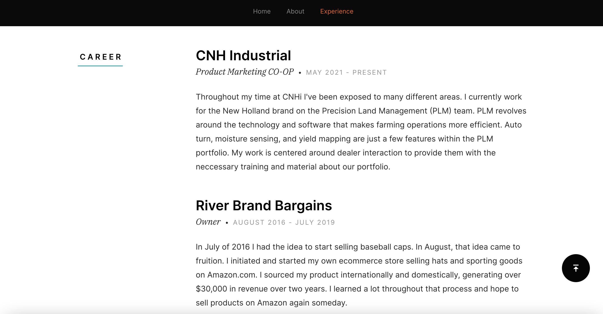
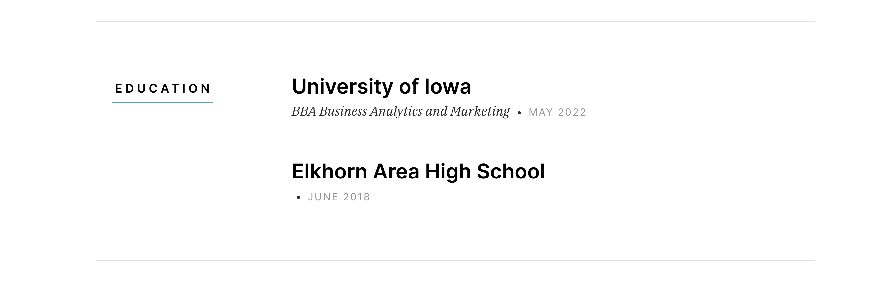

# My Portfolio
The purpose of this project is to display my online presence. I have purchased my own domain that can be found [here](https://granttruesdale.com/). My portfolio website consists of my interests, my career, and everything about me. 

## Table of Contents
* [General Information](#general-information)
* [Technologies Used](#technologies-used)
* [Features](#features)
* [Screenshots](#screenshots)
* [Usage](#usage)
* [Project Status](#project-status)
* [Room for Improvement](#room-for-improvement)
* [Acknowledgements](#acknowledgements)
* [Contact](#contact)

## General Information
- My own website with a custom domain
- Facilitated learning by using HTML and CSS
- Established my online presence

## Technologies Used
 - Github Desktop
 - Visual Studio Code
 - Microsoft Azure
 - Google Analytics

## Features
 - Photos
 - Navigation Pane
 - LinkedIn, Twitter, and GitHub links

## Screenshots

## Usage
The domain that I purchased through namecheap allows users to navigate to my personal website, [granttruesdale.com](https://granttruesdale.com/). Additionally, I can monitor usage by geographic location and page visits through my google analytics account that is linked with my website. 

## Project Status
As of now the project is complete. I will update this website bi-annually to account for my career development. 

## Room For Improvement
 - Include more applicable photos of myself to make it more personal
 - Opportunity to insert a form that will send me a notification if someone would like to ask me a question
 
## Acknowledgements
 - This project was inspired by Professor Mike Colbert at the University of Iowa
 - The foundation of this project stems from the Red Ground template which can be found [here](https://www.free-css.com/free-css-templates)
## Contact
Feel free to reach out with any questions, my contact information can be found at [granttruesdale.com](https://granttruesdale.com/). 
      
      
