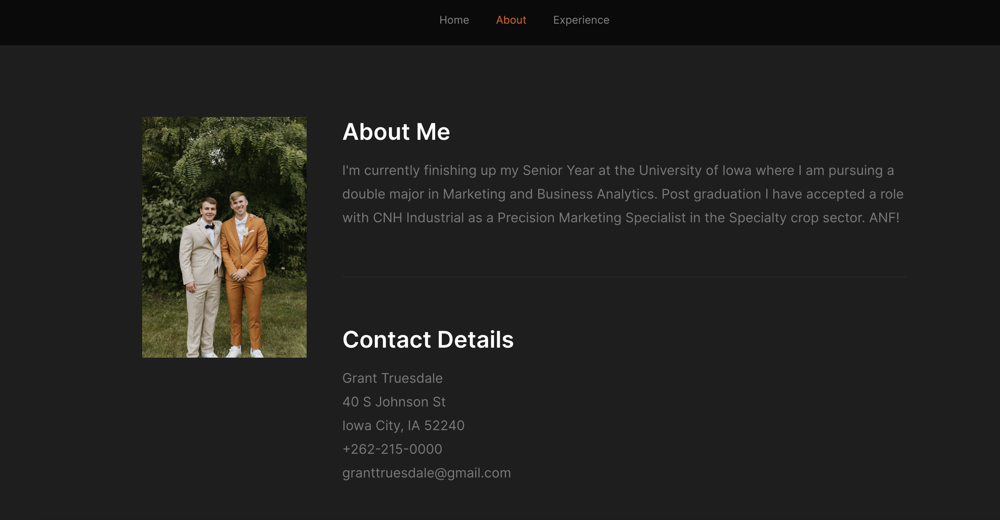

# My Portfolio
The purpose of this project is to display my online presence. I have purchased my own domain that can be found [here](https://granttruesdale.com/). My portfolio website consists of my interests, my career, and everything about me. 

## Table of Contents
* [General Information](#general-information)
* [Technologies Used](#technologies-used)
* [Features](#features)
* [Screenshots](#screenshots)
* [Usage](#usage)
* [Project Status](#project-status)
* [Room for Improvement](#room-for-improvement)
* [Acknowledgements](#acknowledgements)
* [Contact](#contact)

## General Information
- My own website with a custom domain
- Facilitated learning by using HTML and CSS
- Established my online presence

## Technologies Used
 - Github Desktop
 - Visual Studio Code
 - Microsoft Azure
 - Google Analytics

## Features
 - Photos
 - Navigation Pane
 - LinkedIn, Twitter, and GitHub links

## Screenshots

## Set Up

## Usage

## Project Status

## Room For Improvement

## Acknowledgements

## Contact
      
      
